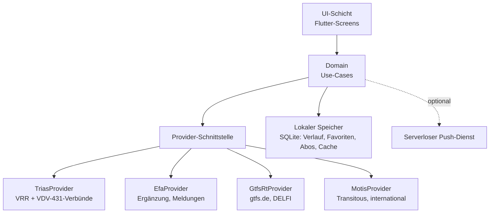

# Konzept: Gleichda – Fahrplan-App VRR (Arbeitstitel)

2026-09-21 · Alessio

## Zielbild und Grundprinzipien

Die App liefert Fahrplanauskunft für den VRR schneller, ehrlicher und übersichtlicher als bestehende Apps und lässt sich später international erweitern. Sie richtet sich an Alltagspendler und Gelegenheitsfahrgäste und läuft auf iOS und Android.

Die Prinzipien leiten sich direkt aus der Kritik an bestehenden Apps ab:

- **Schnell:** Start und erste Anzeige in unter einer Sekunde, gecachte Daten sofort, Echtzeit wird nachgeladen.
- **Wenige Taps:** Jede Kernfunktion in höchstens zwei Taps, letzte Fahrten mit einem Tap neu abrufbar.
- **Ehrlich:** Abweichungen, fehlende Echtzeit und ungenaue Daten werden klar gekennzeichnet statt versteckt.
- **Übersichtlich:** Grafische Darstellung nach Öffi-Vorbild, eine Information pro Zeile.
- **Datensparsam:** Kein Konto, keine Werbung, kein Tracking, alles Persönliche bleibt auf dem Gerät.
- **Ohne eigenen Server:** Einzige Ausnahme ist optional ein kleiner serverloser Dienst für Push-Nachrichten.

## Plattform und Architektur

Empfohlen ist **Flutter (Dart)** mit einer Codebasis für iOS und Android. Flutter startet unter den Cross-Platform-Optionen am schnellsten und scrollt lange Listen flüssig, was genau die Trägheits-Kritik adressiert.

Die App spricht die Datenquellen direkt vom Gerät aus an; CORS spielt bei nativen Apps keine Rolle. Die **Provider-Schnittstelle** kapselt jede Datenquelle hinter denselben Methoden: Orte suchen, Abfahrten, Verbindungen, Fahrt aktualisieren, Meldungen. Vorbilder sind public-transport-enabler (Öffi, Transportr) und KPublicTransport.

| Baustein | Empfehlung |
|---|---|
| Framework | Flutter |
| State-Management | Riverpod oder Bloc |
| Netzwerk | dio (Timeouts, Retry, gzip) |
| Lokale Datenbank | Drift (SQLite) |
| Karte | MapLibre oder flutter_map mit OSM-Kacheln |
| Standort, Kompass | geolocator, flutter_compass |
| Push (optional) | Firebase Cloud Messaging mit Themen pro Linie |
| Widgets, Live Activity | home_widget + native Erweiterungen (Swift, Kotlin) |

## Datenquellen und Echtzeit

Hauptquelle für den VRR ist **TRIAS (VDV 431)**, der offene, herstellerneutrale Standard, den der VRR auf derselben OpenService-Plattform anbietet wie die EFA. Ergänzt wird TRIAS durch **GTFS-RT** für flächendeckende Echtzeit und durch die proprietäre **EFA-Schnittstelle** dort, wo sie nachweislich mehr liefert. International kommt **Transitous (MOTIS 2)** dazu. Die DB-HAFAS-Schnittstelle ist abgeschaltet und scheidet aus.

| Quelle | Zweck | Bedingungen |
|---|---|---|
| VRR TRIAS (VDV 431) | Haltestellensuche, Abfahrten, Verbindungen, Fahrtverlauf mit Echtzeit | offener VDV-Standard, XML; Zugang über OpenService; Namensnennung + „Alle Angaben ohne Gewähr“ |
| VRR EFA OpenService | Ergänzung, wo TRIAS weniger liefert: Meldungen, Umleitungsdetails | proprietär (Mentz), rapidJSON; Produktivzugang per E-Mail an opendata-oepnv@vrr.de; nur Live-Einzelabfragen |
| gtfs.de / DELFI GTFS-RT | Flächendeckende Echtzeit, Service-Alerts | kostenlos; VRR-Busdaten teils lückenhaft |
| DELFI-GTFS / zHV | Offline-Haltestellenindex, Steigkoordinaten, Linienverlauf (shapes) | CC BY 4.0, Namensnennung „DELFI“ |
| OpenStreetMap | Kartenkacheln, Fußwegnetz | ODbL, „© OpenStreetMap-Mitwirkende“; Kachelanbieter noch offen |
| Fußwegrouting (Valhalla, OSRM, GraphHopper) | Abbiegehinweise für die letzten Meter | FOSSGIS-Instanzen ohne Verfügbarkeitszusage; GraphHopper mit Kontingent |
| DB FaSta | Aufzugs- und Fahrtreppenstörungen für barrierefreie Wege | Registrierung im DB API Marketplace |
| Transitous (MOTIS 2) | Internationales Routing, Fußwege mit Schritten | nur Open Source und nicht kommerziell, User-Agent mit Kontakt, Namensnennung |
| Entur, Digitransit u. a. | Länder-Erweiterungen | eigene Keys bzw. Identifikations-Header, Rate-Limits |

Die TRIAS-Anfragen decken alles ab, was die App braucht: `LocationInformationRequest` (Suche), `StopEventRequest` (Abfahrten), `TripRequest` (Verbindungen) und `TripInfoRequest` (Halte einer Fahrt mit Echtzeit, Grundlage für die gespeicherte Fahrt). Weil TRIAS ein VDV-Standard ist, gilt derselbe Adapter in anderen Verbünden und EU-weit; gewechselt wird nur die Basis-URL.

Die EFA bleibt als zweiter Adapter: `XML_STOPFINDER_REQUEST`, `XML_DM_REQUEST`, `XML_TRIP_REQUEST2`, `XML_TRIPSTOPTIMES_REQUEST` und vor allem `XML_ADDINFO_REQUEST` für Störungsmeldungen, jeweils mit `useRealtime=1`. Am Testserver ist zu prüfen, welche Angaben zu Umleitungen und Haltausfällen TRIAS liefert und wo die EFA mehr hergibt; die Status-Werte für Ausfälle und Umleitungen („Explanatory Real Time“) sind bei Mentz lizenzpflichtig und daher möglicherweise nicht verfügbar.

Nicht jedes Unternehmen liefert Echtzeit. Die App muss daher pro Zeitangabe unterscheiden: **Echtzeit vorhanden** oder **nur Fahrplan**.

## Startbildschirm, Suche, Verlauf und Favoriten

Der Startbildschirm ist zugleich die Suche: Von hier ist jede häufige Fahrt mit einem Tap erreichbar. Das löst die Kritik, dass letzte Fahrten neu eingegeben werden müssen.

- **Suchfelder Von/Nach** oben, „Von“ optional mit aktuellem Standort vorbelegt; Tausch-Button; Zeitwahl als Chip („jetzt“, Uhrzeit, Ankunft/Abfahrt).
- **Autovervollständigung offline** aus dem lokalen Haltestellenindex, damit Vorschläge ohne Netz und ohne Verzögerung erscheinen.
- **„Zuletzt gesucht“** als Liste unter dem Suchfeld. Ein Tap führt die Suche erneut mit „jetzt“ aus und zeigt sofort das gecachte Ergebnis, während frische Echtzeitdaten nachgeladen werden.
- **Favoriten** für Verbindungen (z. B. „Zuhause → Arbeit“) und Haltestellen, oben angepinnt, mit Live-Abfahrten direkt auf der Karte des Favoriten.
- **Wischgesten:** Verlaufseintrag nach links wischen löscht, nach rechts macht ihn zum Favoriten.
- **Widget** für den Home-Bildschirm mit den Abfahrten der Lieblingshaltestelle bzw. der nächsten Favoriten-Verbindung.

**Zuletzt angesehene Fahrt: bleibt nach dem Schließen erhalten**

Die zuletzt geöffnete Verbindung steht nach jedem App-Start als Karte ganz oben auf der Startseite und ist mit einem Tap wieder offen, ohne neue Suche. Sie bleibt dabei automatisch aktuell.

- Gespeichert wird die konkrete Fahrt, nicht nur die Suche: Fahrt-Referenz, Linien, Abfahrts- und Umstiegszeiten sowie der letzte bekannte Stand.
- Beim App-Start zeigt die Karte sofort den gespeicherten Stand mit Zeitstempel und lädt parallel die aktuelle Echtzeit für genau diese Fahrt nach.
- Solange die Startseite oder die Fahrt sichtbar ist, aktualisiert sie sich alle 30 s; Verspätungen, Ausfälle und gefährdete Anschlüsse erscheinen direkt auf der Karte.
- Die Karte zeigt kompakt: Linie, Abfahrt mit Echtzeit, Steig, Countdown „in 6 min“ und Warnsymbol bei Abweichungen.
- Nach Ankunft der Fahrt wandert sie automatisch in „Zuletzt gesucht“; per Wischen lässt sie sich vorher entfernen oder als Favorit anheften.
- Dieselbe Fahrt speist Widget und Live Activity, sodass man die App dazu gar nicht öffnen muss.
- Technisch: Die EFA bietet dazu laut Mentz-Dokumentation den TripStopTimes-Request (XML_TRIPSTOPTIMES_REQUEST mit den Parametern line, stopID, tripCode, date, time und useRealtime=1). Er liefert für einen Fahrtabschnitt alle Halte mit Plan- und Echtzeit. Die App speichert diese Kennungen pro Abschnitt aus der Verbindungsantwort und fragt jeden Abschnitt einzeln neu ab. Ob der VRR-OpenService diesen Endpunkt freigibt, ist am Testserver zu prüfen; Rückfallebene ist eine erneute Suche zur gespeicherten Abfahrtszeit mit Abgleich über Linie und Zeiten. Bei MOTIS erfolgt die Neuabfrage über die Trip-ID.

**Standort in Suche und Verbindungen**

Der aktuelle Standort ist überall der Normalfall, wenn er freigegeben ist, bleibt aber optional.

- „Von“ ist mit „Mein Standort“ vorbelegt; die Verbindungssuche startet dann direkt ab Koordinate, inklusive Fußweg zur besten Haltestelle (EFA: `type_origin=coord`, Format Länge:Breite:WGS84[dd.ddddd]).
- Leeres Suchfeld zeigt sofort die nächstgelegenen Haltestellen mit Entfernung und nächsten Abfahrten (EFA: Coord-Request mit Umkreissuche, liefert die Entfernung mit).
- **Gleichnamige Haltestellen** (z. B. „Bahnhof“ oder „Markt“ in mehreren Städten) werden nach Entfernung zum Standort sortiert und immer mit Ort und Entfernung angezeigt: „Markt – Wuppertal-Vohwinkel · 1,2 km“ vor „Markt – Hagen · 28 km“.
- Sortierung in der App: Treffergenauigkeit der Suche und Entfernung werden kombiniert, sodass ein exakter Namenstreffer in der Nähe immer oben steht. Die EFA-Antwort enthält dazu Koordinate, Ort und Trefferqualität je Treffer.
- Ohne Standortfreigabe dient der zuletzt genutzte Ort oder die Heimatregion aus den Einstellungen als Bezugspunkt für die Sortierung.

**Abfahrts- und Ankunftszeit einstellen**

Neben den Suchfeldern steht ein Zeit-Schalter, der standardmäßig „Jetzt“ zeigt. Ein Tipp öffnet ein Fenster von unten:

- Umschalter **Abfahrt um / Ankunft um**; bei Ankunft rechnet Gleichda rückwärts und bezieht den Fußweg ein.
- Tag: Heute, Morgen oder ein Datum.
- Uhrzeit als Rad mit Stunden und Minuten in 5-Minuten-Schritten.
- Schnellwahl: Jetzt, in 30 min, in 1 Std, morgen früh.
- Eine Zeile erklärt die Wirkung im Klartext, z. B. „Verbindungen, die bis 17:30 ankommen“.

Nach dem Schließen zeigt der Schalter die gewählte Zeit („Ankunft 17:30“), damit nie unklar ist, ob gerade ab jetzt gesucht wird. „Jetzt“ stellt auf die laufende Aktualisierung zurück. Der Zeitbezug steht damit bei der Zeit und nicht mehr in den Suchoptionen; dort bleiben Zwischenhalt, Profil, Verkehrsmittel und barrierefreie Wege.

## Verbindungsliste und Fahrtverlauf

Verbindungen werden grafisch als Zeitleiste dargestellt, nicht als Textblock, und die Liste zeigt mehr als nur die schnellsten Fahrten. Vorbild ist Öffi.

**Verbindungsliste**

- Jede Verbindung ist ein horizontaler Balken, Länge proportional zur Reisezeit. Abschnitte in Linienfarbe, Fußwege grau, Wartezeiten als Lücke.
- Darunter eine Zeile: Abfahrt, Ankunft, Dauer, Umstiege, Echtzeit-Symbol, Warnsymbol bei Abweichungen.
- **Suchprofile als Chips:** Schnellste, Wenigste Umstiege, Wenig Fußweg, Barrierefrei. Dazu Verkehrsmittel ausschließen (z. B. „nur Bus“) und maximale Umstiege.
- **Zusammengeführte Ergebnisse:** Zwei bis drei Profile werden parallel abgefragt, Doppelte entfernt, Etiketten wie „schnellste“ oder „ohne Umstieg“ markieren die Besonderheit.
- Endloses Scrollen nach früher und später statt „Weitere Verbindungen“-Buttons.

**Zeitraster (Ansicht wie in Öffi)**

- Umschalter rechts neben der Route: **Liste** oder **Zeitraster**.
- Im Zeitraster läuft die Zeit von oben nach unten (Skala in 5-Minuten-Schritten), jede Verbindung ist eine Spalte.
- Fahrten als Balken in Linienfarbe mit Liniennummer, Länge entspricht der Fahrzeit; Fußwege und Umstiege als gepunktete Linie, Wartezeiten dadurch als Lücke sichtbar.
- Über jeder Spalte Abfahrtszeit (farbig bei Echtzeit bzw. Verspätung) und Dauer; nicht erreichbare Verbindungen blass.
- **Die gewählte Ansicht wird lokal gespeichert** und beim nächsten Öffnen wieder verwendet, auch nach einem Neustart der App.

**Fahrtverlauf**

- Vertikale Linie mit allen Halten; bereits passierte Halte ausgegraut, aktuelle Position markiert.
- Ein- und Ausstieg fett hervorgehoben, Zwischenhalte einklappbar.
- Pro Halt Plan- und Ist-Zeit nebeneinander, Verspätungen farbig, Steig bzw. Gleis rechts.
- Tap auf eine Linie zeigt den gesamten Linienverlauf dieser Fahrt.

## Abfahrten in der Nähe

Der Abfahrten-Tab zeigt mehrere Haltestellen in der Nähe untereinander, sortiert nach Entfernung, statt nur eine auswählbare Haltestelle.

- Je Haltestelle: Name, Entfernung und Gehzeit (z. B. „120 m · 2 min“), darunter die nächsten Abfahrten und „Alle Abfahrten“.
- **Zeit einstellbar:** Schalter „Jetzt“ öffnet ein Auswahlfenster mit Heute, Morgen oder Datum, Schnellwahl (Jetzt, +15 min, +30 min, +1 Std) und genauer Uhrzeit. Danach zeigt der Schalter z. B. „ab 14:44“.
- Filter „Alle Verkehrsmittel“ zum Einschränken nach Bus, Schwebebahn, Bahn.
- Ausfälle durchgestrichen mit nächster Alternative, SEV violett mit Hinweis auf die Lage des Ersatzhalts.

## Abweichungen, Ausfälle und Anschlüsse

Eine Abweichung ist nie nur ein kleines Icon: Sie steht in Klartext ganz oben und im Fahrtverlauf am betroffenen Halt.

**Abweichungen sichtbar machen**

- Farbiges Banner oben in der Fahrt, z. B. „Umleitung: 3 Halte entfallen“ oder „Fahrt fällt aus“.
- Im Fahrtverlauf entfallene Halte rot und durchgestrichen, Umleitungshalte in eigener Farbe, extra Warnung wenn Ein- oder Ausstieg betroffen ist.
- Warnsymbol mit Kurztext schon in der Ergebnisliste.

**Alternativen bei Ausfall**

- Button „Alternativen anzeigen“ direkt im Ausfall-Banner startet ohne Eingabe eine Suche vom betroffenen Halt oder vom Standort zum Ziel.
- Ergebnisse erscheinen inline unter dem Banner: zuerst die nächste Fahrt derselben Linie, dann Umwege mit Zeitdifferenz („+12 min“).

**Echtzeit ehrlich kennzeichnen**

- Zeiten mit Echtzeit: Live-Symbol, grün bei pünktlich, orange/rot bei Verspätung.
- Zeiten ohne Echtzeit: neutral mit Hinweis „nur Fahrplan“.

**Anschlussprüfung**

- Die App prüft jeden Umstieg: erwartete Ankunft plus Umsteigeweg gegen erwartete Abfahrt des Anschlusses. Ergebnis: sicher, knapp oder nicht erreichbar.
- Nicht erreichbare Verbindungen werden ausgegraut ans Listenende sortiert mit Hinweis („2 Verbindungen wegen Verspätung nicht erreichbar“).
- Persönliche Umsteigegeschwindigkeit in den Einstellungen (langsam, normal, schnell); wird an die EFA als Parameter übergeben.

## Aktualität, Übersichtlichkeit und persönliche Bedürfnisse

Angezeigte Daten sind immer sichtbar aktuell, die Oberfläche folgt festen Gestaltungsregeln, und die Suche richtet sich nach den Bedürfnissen der Person statt nur nach der kürzesten Reisezeit.

**Aktualität**

- Geöffnete Abfahrten, Verbindungen und Fahrten aktualisieren sich automatisch (z. B. alle 30 s), solange sie sichtbar sind.
- Sichtbarer Zeitstempel „Stand: vor 20 s“; ist er älter als 2 min oder fehlt das Netz, wird er orange mit Hinweis „Daten nicht aktuell“.
- Gecachte Ergebnisse (z. B. aus dem Verlauf) sind bis zur Aktualisierung als „wird aktualisiert“ markiert und werden nie als aktuell ausgegeben.
- Pull-to-refresh überall; geänderte Zeiten blinken kurz auf, damit Änderungen auffallen.

**Übersichtlichkeit: feste Gestaltungsregeln**

- Die wichtigste Information zuerst und am größten: Abfahrtszeit, Linie, Steig.
- Einheitliche Farbsprache in der ganzen App: grün pünktlich, orange verspätet, rot Ausfall, violett SEV, grau nur Fahrplan.
- Linien immer in ihrer Originalfarbe und Form (Bus, Schwebebahn, S-Bahn).
- Details erst auf Tap; keine Textwüsten, keine doppelten Angaben.
- Große Schrift und Kontraste auch bei Sonnenlicht; Dunkelmodus.

**Persönliche Bedürfnisse**

- Persönliches Profil in den Einstellungen: Gehgeschwindigkeit, Umsteigezeit, maximaler Fußweg, bevorzugte und ausgeschlossene Verkehrsmittel, barrierefreie Wege (Aufzüge, keine Treppen), Fahrradmitnahme.
- Das Profil gilt für jede Suche automatisch; ein Chip zeigt, dass es aktiv ist, und lässt sich für eine Suche abschalten.
- Mehrere Profile möglich, z. B. „Alltag“ und „mit Kinderwagen“.
- Pro Favorit ein eigenes Suchprofil, z. B. „Zur Arbeit: wenigste Umstiege“.
- Die App lernt Gewohnheiten nur auf dem Gerät: Werktags um 7 Uhr steht „Zuhause → Arbeit“ automatisch oben auf dem Startbildschirm. Abschaltbar, nichts verlässt das Gerät.

## Meldungen und Linienabos

Ein eigener Tab bündelt alle Störungsmeldungen; abonnierte Linien lösen bei Änderungen Push-Nachrichten aus. Für zuverlässige Pushs ist ein kleiner serverloser Dienst nötig.

**Meldungsliste**

- Filter: Meine Linien, Meine Haltestellen, Alle.
- Pro Meldung: betroffene Linien als farbige Chips, Zeitraum, Klartext, Link zu betroffenen Halten.
- Quellen: EFA-Störungsmeldungen und Service-Alerts aus GTFS-RT.

**Linienabos**

- Abo per Stern an jeder Linie oder in der Meldung; optional Zeitfenster (z. B. nur werktags 6–9 Uhr).
- Push öffnet direkt die betroffene Meldung oder Fahrt.

| Variante | Funktionsweise | Bewertung |
|---|---|---|
| Rein lokal | App fragt selbst periodisch ab (Android WorkManager, iOS Background Fetch) | Android frühestens alle 15 min, iOS unzuverlässig |
| Serverlos (empfohlen) | Cron-Funktion (z. B. Cloudflare Worker) prüft Meldungen alle paar Minuten, sendet Push über Firebase an Themen wie `linie_WSW_620` | zuverlässig, im Kostenlos-Bereich, keine Nutzerdaten nötig |
| Hybrid | Start lokal, später serverlos | geringster Einstiegsaufwand |

## Navigation zur Haltestelle und SEV

Die App führt steig-genau zur Abfahrt, mit echter Fußgänger-Navigation in der App statt bloßer Übergabe an Google Maps. SEV-Halte werden eigens gekennzeichnet und ehrlich behandelt, wenn Daten fehlen.

**Steig-genaues Ziel**

- Ziel ist immer der konkrete Steig mit Fahrtrichtung („Steig 2 – Richtung Vohwinkel“), damit die Straßenseite klar ist.
- Koordinaten aus dem zHV (Steig-Ebene) und OpenStreetMap; fehlen sie, zeigt die App „genaue Position unbekannt“.
- Countdown „Loslaufen in 3 min“ aus Gehzeit und Echtzeit-Abfahrt, optional als Benachrichtigung; frühe Warnung, wenn der Bus kaum erreichbar ist.

**Stufe 1: „Letzte Meter“-Modus**

- Karte mit Standort, Blickrichtung, Fußweg und markiertem Steig; andere Steige ausgegraut.
- Richtungspfeil mit Entfernung („80 m, schräg rechts“).

**Stufe 2: Abbiegehinweise wie bei Maps**

- Fußweg mit Schritt-Anweisungen aus MOTIS/Transitous oder OpenRouteService (API-Key, Kontingent); später optional Offline-Routing.
- Neuberechnung bei Abweichung vom Weg, optionale Sprachansagen.
- Übergabe an Google/Apple Maps bleibt als Rückfallebene.

**SEV-Halte**

- Eigene Farbe und Symbol auf Karte und im Fahrtverlauf.
- Beschreibung aus der Meldung („Ersatzhaltestelle in der XY-Straße“) groß direkt am Halt.
- Plausibilitätsprüfung: SEV-Halt auf denselben Koordinaten wie der reguläre Halt wird als „Position unsicher“ markiert.
- Später optional: Meldefunktion „Haltestelle hier gefunden“ (braucht Backend) oder Korrekturen über OpenStreetMap.

## Menüführung und Unterwegs-Modus

Vier feste Tabs, jede Funktion an genau einem Ort, und ein Unterwegs-Modus, der während der Fahrt immer nur den nächsten Schritt zeigt.

**Menüführung**

| Tab | Inhalt |
|---|---|
| Suche | Suchfelder, Favoriten, Zuletzt gesucht |
| Abfahrten | Abfahrtsmonitor für Standort oder gewählte Haltestelle |
| Meldungen | Störungen, gefiltert nach Abos und Favoriten |
| Mehr | Linienabos, Einstellungen, Datenschutz, Impressum |

- Kein Hamburger-Menü, Klartext unter jedem Icon.
- „Zurück“ führt immer genau eine Ebene zurück, Eingaben bleiben erhalten.
- Push-Nachrichten öffnen direkt die betroffene Fahrt oder Meldung.

**Unterwegs-Modus**

- Start per „Losfahren“ in einer Verbindung.
- Oben groß nur der nächste Schritt: „Bus 620 Richtung Vohwinkel, Steig 3, in 4 min“, später „Aussteigen in 2 Halten“.
- Gleiche Anzeige als Live Activity (iOS) bzw. laufende Benachrichtigung (Android).
- Bei Abweichung springt der Modus auf das Warnbanner mit „Alternativen anzeigen“.
- GPS nur optional und nur während der aktiven Begleitung; sonst läuft der Modus über Fahrplan- und Echtzeitdaten.

**Inhalt der Benachrichtigung während der Fahrt**

Die laufende Benachrichtigung (Live Activity auf iOS, dauerhafte Benachrichtigung auf Android) bleibt bewusst auf das Nötigste beschränkt, damit sie im Vorbeischauen erfassbar ist:

- Kopfzeile: App-Symbol und Liniennummer
- **Wo:** „Aussteigen“ und der Name der Ausstiegshaltestelle
- **Wann:** groß die verbleibenden Minuten, darunter die Uhrzeit
- **Fortschritt:** ein Balken bis zum Ausstieg. Die aktuelle Position ist das Fahrzeug selbst, als kleines geneigtes Symbol im Stil des Logos; der Ausstieg ist die Zielmarke am Ende. Es gibt ein Symbol je Fahrzeugtyp: Bus, Straßenbahn, Stadtbahn, Zug, Schwebebahn und Fähre; sie werden auch sonst in der App verwendet, wo ein Verkehrsmittel gekennzeichnet wird

Alles Weitere, also Fahrtverlauf, Umstieg, Abweichungen und Alternativen, steht einen Tipp entfernt in der Fahrt selbst. Auf Android gibt es zusätzlich die Schaltfläche „Beenden“, auf iOS die kompakte Form für die Dynamic Island mit den verbleibenden Minuten und der Uhrzeit.

## Fahrtenwecker und eigene Orte

Wiederkehrende Fahrten wie der Arbeitsweg werden einmal eingerichtet und danach automatisch überwacht; gespeicherte Orte ersparen das Tippen von Adressen.

**Fahrtenwecker**

- Ein Wecker besteht aus Name, Start und Ziel, Zeitbezug (ankommen um / losfahren um), Wochentagen und Vorlaufzeit zum Losgehen.
- Die App rechnet Gehzeit und Echtzeit mit ein und weckt zum tatsächlichen Aufbruchszeitpunkt, nicht zur Fahrplanzeit.
- Option „Bei Störung früher wecken“: Fällt die übliche Fahrt aus oder ist sie verspätet, klingelt der Wecker entsprechend früher und schlägt die Alternative vor.
- Option „Unterwegs-Modus starten“: Mit dem Wecker beginnt automatisch die Begleitung auf dem Sperrbildschirm.
- Liste aller Wecker mit Schalter zum Aktivieren, den Wochentagen als Kreisen und einer Zeile mit dem nächsten Weckzeitpunkt und dem aktuellen Status der Linie.
- Technisch: Der Weckzeitpunkt steht lokal fest, die Prüfung der Echtzeit kurz vorher läuft über denselben Dienst wie die Linienabos (siehe Meldungen und Linienabos).

**Eigene Orte**

- Feste Orte „Zuhause“ und „Arbeit“ sowie beliebig viele weitere gespeicherte Adressen und Haltestellen.
- Orte erscheinen in der Suche ganz oben, lassen sich in Weckern als Start oder Ziel wählen und werden nur auf dem Gerät gespeichert.
- Erreichbar über Mehr → Meine Orte; dort auch umbenennen und löschen.

## Gestaltung

Die App wirkt dezent, modern und wie eine native App, nicht wie ein generiertes Design. Der Entwurf liegt als Klick-Prototyp auf der Design-Leinwand.

**Grundregeln**

- Systemschrift des Geräts (San Francisco bzw. Roboto), keine Schmuckschriften, keine Verläufe, Schatten oder Zierelemente.
- Inhalte in schlichten, gruppierten Listen mit feinen Trennlinien; Überschriften in normaler Schreibweise.
- Farbe nur mit Bedeutung: Petrol für Aktionen und aktive Tabs, grün pünktlich, orange verspätet oder Umleitung, rot Ausfall, violett SEV, grau „nur Fahrplan“.
- Hell- und Dunkelmodus, automatisch nach Systemeinstellung, zusätzlich manuell umschaltbar.

**Nichts springt, nichts bricht merkwürdig um**

- Gleich breite Ziffern für alle Zeiten, fester Platz für Verspätungen wie „+3“.
- Namen einzeilig mit „…“ statt Umbruch; Fließtexte ohne Silbentrennung und ohne einzelne Wörter in der letzten Zeile.
- Ladezustände mit Platzhaltern in exakt der späteren Größe.

**Animationen**

- Screenwechsel als kurzes Schieben (etwa 250 ms), geänderte Zeiten blenden am selben Platz über, Live-Punkt pulsiert sanft.
- Bei „Bewegung reduzieren“ in den Systemeinstellungen entfallen Animationen.

**iPhone und Android**

- Gleiche Screens, gleiche Inhalte und gleiches Design auf beiden Plattformen.
- Unterschiede nur, wo das System sie vorgibt: Schrift, Zurück-Pfeil oben links, untere Navigationsleiste, Ränder für Status- und Gestenleiste.

**Logo und Name**

- Name: **Gleichda**.
- Logo: Zug, Straßenbahn und Bus, nach vorn geneigt und hintereinander gestaffelt; der Bus fährt vorne. Weiß auf Petrol, Scheinwerfer des Busses in Bernstein; im Dunkelmodus hell-petrol auf dunklem Grund. Mittig mit gleichen Randabständen.
- Kleine Größen (Favicon, Benachrichtigung): nur der Bus.
- Schrift für den Namen: vorläufig Rubik fett kursiv (Alternativen: Nunito kursiv, Outfit geneigt).
- Im App-Inneren erscheint das Logo nur auf der Startseite und auf dem Startbild.

**Screens im Entwurf**

| Bereich | Screens |
|---|---|
| Suchen | Startbild, Start, Suche, Suche mit Eingabe, Suchoptionen, Zeit einstellen, Verbindungen als Liste, Verbindungen als Zeitraster |
| Fahren und Informieren | Fahrtdetail, Alternativen, Weg zum Steig, Unterwegs (Live-Aktivität bzw. Benachrichtigung), Abfahrten, Meldungen, Fahrtenwecker, Neuer Wecker, Meine Orte, Mehr |
| Zustände | Laden, Offline, Fehler |

Der Bereich **Mehr** enthält Fahrtenwecker, Meine Orte, Favoriten und Verlauf, Profil, Linienabos, Erscheinungsbild, Umsteigezeit, Gehgeschwindigkeit, barrierefreie Wege, Standort, Verlauf löschen, Datenquellen, Datenschutz und Impressum sowie die Pflichtangabe „Fahrplandaten: VRR, DELFI e. V. Alle Angaben ohne Gewähr“.

## Datenschutz und Recht

Datensparsamkeit ist ein Verkaufsargument: Die volle Leistung der App gibt es ohne Konto und ohne Standortfreigabe.

**Datenschutz**

- Kein Konto, kein Login; Verlauf, Favoriten und Abos nur auf dem Gerät.
- Standort optional und nur „bei Nutzung“; jede Funktion auch per Eingabe nutzbar.
- Keine Werbung, keine Tracking- oder Analyse-SDKs.
- Transparent benennen, was trotzdem das Gerät verlässt: Suchanfragen an VRR bzw. Transitous, Push-Token bei Google/Apple.

**Pflichten vor Veröffentlichung**

1. Produktivzugang EFA beim VRR beantragen, API-Key-Frage für serverlose App klären
2. Namensnennung der Datenquellen und Satz „Alle Angaben ohne Gewähr“ in der App
3. Datenschutzerklärung auf Store-Seite und in der App (auch offline)
4. Apple App Privacy und Google Data Safety korrekt ausfüllen
5. Impressum
6. Bei kostenpflichtiger App: Zustimmung des VRR einholen; Transitous dann nicht nutzbar

## Datenmodell

Alle Provider liefern in dieselben Kernobjekte; die App kennt nur dieses Modell, nie die Rohformate der Datenquellen.

| Objekt | Wichtige Felder |
|---|---|
| Haltestelle | id, providerId, name, ort, lat, lon, steige[], verkehrsmittel[] |
| Steig | id, haltestelleId, bezeichnung, richtung, lat, lon, istSEV |
| Verbindung | id, tripRef, abschnitte[], abfahrt, ankunft, umstiege, profil[], anschlussStatus |
| Abschnitt | typ (Fahrt/Fußweg), linie, richtung, vonHalt, nachHalt, zeitPlan, zeitIst, echtzeit (ja/nein), steig, halte[], meldungen[] |
| Halt im Verlauf | haltestelleId, zeitPlan, zeitIst, status (normal/entfällt/Umleitung/SEV), steig |
| Abfahrt | linie, richtung, zeitPlan, zeitIst, echtzeit, steig, status, meldungen[] |
| Meldung | id, linien[], halte[], von, bis, titel, text, quelle |
| Verlaufseintrag | vonId, nachId, profil, zuletztGenutzt, gecachtesErgebnis |
| Favorit | typ (Verbindung/Haltestelle), ref, name, reihenfolge |
| Linienabo | linienId, providerId, zeitfenster, pushThema |

## Roadmap

Zuerst der VRR-Kern mit dem Alleinstellungsmerkmal „schnell und ein Tap zur letzten Fahrt“, danach Schritt für Schritt die weiteren Funktionen.

| Stufe | Inhalt |
|---|---|
| 1 – MVP | TriasProvider gegen Testserver, Haltestellensuche offline, Abfahrten, Verbindungssuche mit Zeitleiste, Fahrtverlauf, zuletzt angesehene Fahrt dauerhaft und live auf der Startseite, Verlauf und Favoriten mit One-Tap-Neuabfrage, Echtzeit-Kennzeichnung |
| 2 – Verlässlichkeit | Abweichungs-Banner, Alternativen bei Ausfall, Anschlussprüfung, Suchprofile mit zusammengeführten Ergebnissen, persönliches Profil, automatische Aktualisierung mit Zeitstempel, Meldungsliste |
| 3 – Unterwegs | „Letzte Meter“-Navigation steig-genau, SEV-Kennzeichnung, Unterwegs-Modus, Widgets, Live Activity |
| 4 – Push | Linienabos, erst lokal, dann serverloser Push-Dienst |
| 5 – Erweiterung | Abbiegenavigation, MotisProvider für internationale Abdeckung, weitere Länder-Adapter |

Vor der ersten Store-Veröffentlichung müssen die Pflichten aus dem Abschnitt Datenschutz und Recht erledigt sein.

## Offene Entscheidungen

1. Push-Variante: rein lokal, serverlos oder hybrid?
2. Kostenlos und Open Source (Transitous nutzbar) oder kommerziell (eigenes MOTIS bzw. VRR-Zustimmung nötig)?
3. Wie gut beschreibt TRIAS Umleitungen und entfallene Halte im VRR, und wo liefert die EFA mehr? Am Testserver beide vergleichen.
   **Geprüft 23.09.2026 am Testserver** (`dart run tool/fixtures.dart`, Antworten in `test/fixtures/`):
   - TRIAS (`openservice-test.vrr.de/static02/trias`) beantwortet `LocationInformationRequest`, `StopEventRequest` und `TripRequest` ohne Zugangsschlüssel. **`TripInfoRequest` lehnt der Server mit HTTP 400 ab** (auch mit Version 1.2 und unter `static03`). Den Fahrtverlauf einer gespeicherten Fahrt holt die App deshalb über die EFA (`XML_TRIPSTOPTIMES_REQUEST`, liefert alle Halte mit Plan- und Echtzeit und Koordinaten; die Uhrzeit im Aufruf ist unkritisch). Rückfall: dieselbe Verbindung per `TripRequest` neu suchen und über Linien und Planzeiten wiederfinden.
   - Die TRIAS-Fahrtreferenz lässt sich direkt in EFA-Kennungen umsetzen: `wsw:66604::R:w25:266` → line `wsw:66604: :R:w25`, tripCode `266`.
   - Echtzeit: TRIAS liefert `EstimatedTime` je Halt, Meldungen nur als `PtSituation` im Kontext der Antwort (z. B. „Aufzug außer Betrieb“, DB-Meldungen). Die EFA-Abfahrten nennen Umleitungen zusätzlich in der Linienbeschreibung („(Umleitung Rott)“), `XML_ADDINFO_REQUEST` liefert VRR-weit rund 1100 Meldungen mit Klartext – dafür bleibt die EFA die Quelle der Meldungsliste. Haltausfälle (`NotServicedStop`) kamen in den Stichproben nicht vor; der Parser wertet sie aus, geprüft ist das noch nicht.
   - Eigenheiten: Die Schwebebahn hat in Abfahrten keinen Liniennamen und heißt in Verbindungen „Schwebebahn“ – die Nummer 60 kommt aus der Linienkennung `wsw:64060`. Die Suche liefert Treffer nicht nach Trefferqualität sortiert („Hauptbahnhof (SEV)“ mit 0,25 vor „Wuppertal Hbf“ mit 0,998); die App sortiert selbst.
4. Lizenzstatus der VRR-GTFS-Dateien klären oder direkt DELFI-GTFS verwenden.
5. Testfälle sammeln: Wuppertaler Haltestellen mit häufiger Steig-Verwechslung und aktuelle SEV-Situationen.
6. Name „Gleichda“ steht fest; Verfügbarkeit in App Store, Google Play, Domain und Markenregister (DPMA, EUIPO) prüfen.
7. Kartenkacheln: FOSSGIS-Server, Anbieter mit Kontingent oder Vektorkacheln offline mitliefern? Hängt daran, ob das Projekt kommerziell wird.

1. Schrift für den Namen endgültig festlegen (Rubik, Nunito oder Outfit).
2. Pfeile zwischen Start und Ziel sowie zwischen Linien überarbeiten.
3. Später gestalten: erster Start mit Standort-Erklärung, Haltestellen- und Meldungsdetail, Widget.
